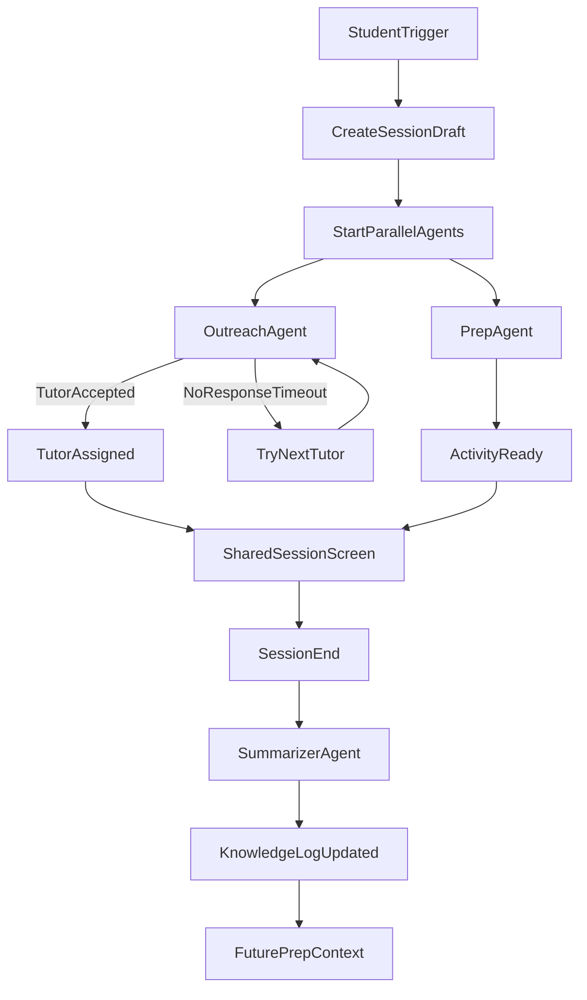

# Mandarin Tutor MVP Planning Series

## Goal
Create a concise MVP PRD for the multiplayer Mandarin tutor platform that is implementation-ready for a Day 1 happy-path demo and extensible for future sessions.

## Planning Principles
- Optimize for one end-to-end loop: trigger -> outreach + prep -> shared session -> summary log.
- Treat AI as producer/orchestrator, not the human tutor replacement.
- Design for mixed tutor proficiency in the same product surface.
- Keep data minimal and privacy-aware from day one.
- Prefer reversible architecture decisions over heavy abstractions.

## Recommended Session Cadence
Run 4 short sessions (60-90 minutes each), then a 30-minute final sign-off.

### Session 1: Product Scope Lock (What are we actually building?)
**Objective**
- Freeze MVP boundaries and non-goals.

**Agenda**
- Confirm personas and primary use case.
- Define Day 1 happy path in exact steps.
- Identify explicit non-goals (video, advanced adaptive graphing, multi-language expansion in MVP).
- Establish success metrics for first demo.

**Output**
- MVP scope statement.
- Non-goals list.
- Day 1 acceptance criteria.

## Session 2: Experience Design (How should it feel in real use?)
**Objective**
- Make the core student+tutor flow concrete for zero-knowledge and fluent tutors.

**Agenda**
- Storyboard trigger flow and shared session flow.
- Specify tutor UI adaptations by proficiency level.
- Define 3-5 initial activity templates (food vocab, tone match, scavenger hunt, mini-story).
- Define post-session summary UX.

**Output**
- UX flow map for guardian, student, tutor.
- Activity object requirements.
- UI content tone guide (warm/playful/confidence-building).

## Session 3: Agent + Data Design (How does the loop run?)
**Objective**
- Define the minimum robust orchestration for Outreach, Prep, and Summarizer agents.

**Agenda**
- Define trigger event contract and state transitions.
- Define Outreach policy (priority, timeout, retries/fallback).
- Define Prep inputs/outputs and level-adaptive prompt strategy.
- Define Summarizer schema for retention signals and next-session notes.
- Define minimal data retention + anonymization boundaries.

**Output**
- Agent contracts and sequence flow.
- Minimal schema list for Supabase tables.
- Prompting contracts and failure behavior.

## Session 4: Technical PRD Draft (How do we implement with low risk?)
**Objective**
- Produce a concise PRD with implementation constraints and testable acceptance criteria.

**Agenda**
- Confirm stack choices and service boundaries (Next.js, Supabase, Anthropic, Twilio).
- Define API routes/actions needed for happy path.
- Define Realtime shared state contract.
- Define error/fallback UX (no tutor response, prep delay, SMS fail).
- Define Day 1 demo checklist and test plan.

**Output**
- MVP PRD v1.
- Architecture overview and API surface.
- Test checklist for demo readiness.

## Final Sign-Off (30 min)
**Objective**
- Resolve open decisions and freeze PRD for implementation.

**Agenda**
- Triage unresolved decisions by impact.
- Confirm launch slice and backlog defer list.
- Assign build ownership for first implementation sprint.

**Output**
- PRD v1 approved.
- “Build now” task list for sprint 1.
- Deferred roadmap list.

## Decision Log Template (Use in every session)
- Decision
- Options considered
- Chosen approach
- Why now
- Revisit trigger

## MVP Exit Criteria (Must be true)
- Guardian can add at least one tutor with level metadata.
- Student can trigger “I need help”.
- Outreach sends SMS with valid join link to tutor.
- Prep agent returns a structured 10-minute activity adapted to tutor level.
- Shared session renders student game + tutor facilitation cues.
- Session completion writes summary/retention notes to persistence.

## Risks To Track Early
- Prompt quality variance across tutor proficiency levels.
- Tutor outreach latency and no-response handling.
- Shared session synchronization edge cases.
- Privacy boundaries for child learning data.
- Scope creep into video/recommendation complexity.

## Immediate Next Step
Start Session 1 with a strict “must-have vs nice-to-have” pass on every feature in your prompt, then freeze non-goals before discussing architecture.